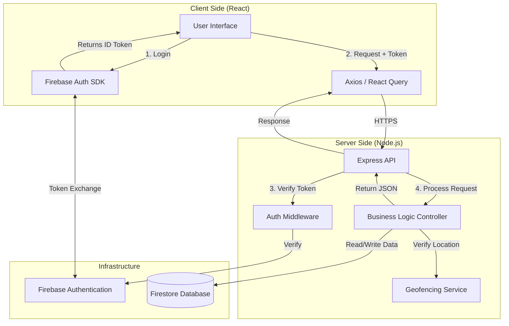

# TeamTimeTracker - Architecture & Migration Plan

**Date:** January 13, 2026
**Target Architecture:** ReactJS (Frontend) + NodeJS (Backend API) + Firebase (Auth & Firestore)
**Document Type:** Technical Specification & Migration Guide

---

## 1. Project Analysis & Current State

### 1.1 Current Architecture
The current application is a **Serverless / Thick-Client** PWA.
- **Frontend:** React (Vite) + TypeScript + TailwindCSS.
- **State Management:** Zustand (persisted to `localStorage`).
- **Backend Logic:** None. All business logic (e.g., calculating work hours, checking geofence, approving leaves) resides in the browser.
- **Database:** Firebase Firestore, accessed directly via the Client SDK.
- **Authentication:** Firebase Auth (Google, Microsoft, Phone), but relies on client-side logic for role management.
- **Security Risk:** High. Since the client writes directly to Firestore, a savvy user could modify the code to bypass geofencing, approve their own leaves, or modify attendance records.

### 1.2 User Flows
1.  **Authentication:** Users login via Phone/Social. Accounts are created in Firestore `employees` collection if they don't exist.
2.  **Attendance:** Users "Punch In" (captures geolocation). App calculates distance from office. If valid, writes to `attendance` collection.
3.  **Leaves:** Users submit requests to `leaves`. Managers/Admins query this collection to approve/reject.
4.  **Tasks:** Managers create tasks in `tasks`. Users update status. Comments stored in `task_comments`.

---

## 2. Data Model Extraction (Entities)

Based on the existing `types.ts` and usage:

### 2.1 User (Employee)
*Matches `employees` collection.*
- **uid** (String, PK): Maps to Firebase Auth UID.
- **name** (String): Full name.
- **email** (String, Unique): Corporate email.
- **role** (Enum): `Admin`, `Manager`, `Employee`.
- **status** (Enum): `active`, `inactive`.
- **designation** (String, Optional): Job title.
- **phone** (String): Contact number.
- **avatarUrl** (String, Optional).
- **geoLock** (Boolean): Whether strict geofencing applies to this user.

### 2.2 Attendance
*Matches `attendance` collection.*
- **id** (String, PK).
- **employeeId** (String, FK -> User).
- **date** (String): YYYY-MM-DD (Indexed for range queries).
- **punchIn** (Timestamp).
- **punchOut** (Timestamp, Nullable).
- **durationMinutes** (Number): Calculated by backend.
- **location** (Object): `{ lat, lng, address, isVerified }`.
- **mood** (String, Optional).
- **workLog** (String, Optional).

### 2.3 Leave
*Matches `leaves` collection.*
- **id** (String, PK).
- **employeeId** (String, FK -> User).
- **type** (Enum): `Sick`, `Casual`, `Privilege`.
- **status** (Enum): `pending`, `approved`, `rejected`, `cancelled`.
- **startDate** (Date).
- **endDate** (Date).
- **reason** (String).
- **approverId** (String, FK -> User, Optional).
- **approverNote** (String, Optional).

### 2.4 Task
*Matches `tasks` collection.*
- **id** (String, PK).
- **title** (String).
- **description** (String).
- **assignedTo** (String, FK -> User).
- **assignedBy** (String, FK -> User).
- **priority** (Enum): `low`, `normal`, `high`, `urgent`.
- **status** (Enum): `todo`, `in_progress`, `review`, `done`.
- **dueDate** (Date, Optional).

### 2.5 CompanySettings
*Singleton document.*
- **officeLocation** (GeoPoint): Lat/Lng of the office.
- **allowedRadiusMeters** (Number): Geofence radius (e.g., 300m).
- **adminEmails** (Array<String>): Fallback admin list.

---

## 3. Database Schema (Firestore)

We will maintain the document-oriented structure but optimize for backend access.

**Why Firestore?** 
- Flexible schema allows easy addition of fields (e.g., `metadata` for audit logs).
- fast queries for dashboard lists.
- Real-time listeners can still be used for specific features (like Notifications) if strictly secured.

```json
/* /users/{uid} */
{
  "email": "user@company.com",
  "role": "Employee",
  "profile": { "name": "...", "phone": "..." },
  "stats": { "leavesUsed": 5, "avgWorkHours": 8.2 } // Aggregated by backend
}

/* /attendance/{autoId} */
{
  "userId": "user_123",
  "date": "2026-01-13",
  "punches": [
    { "type": "IN", "time": "09:00:00Z", "loc": {...} },
    { "type": "OUT", "time": "18:00:00Z", "loc": {...} }
  ],
  "status": "PRESENT" // or HALF_DAY, ABSENT
}

/* /leaves/{autoId} */
{
  "userId": "user_123",
  "range": { "start": "...", "end": "..." },
  "status": "PENDING",
  "audit": [
    { "action": "CREATED", "by": "user_123", "at": "..." },
    { "action": "APPROVED", "by": "mgr_456", "at": "..." }
  ]
}
```

---

## 4. Authentication & Security Strategy

### 4.1 Authentication Flow
1.  **Client:** Uses Firebase SDK (`signInWithPopup` / `signInWithPhoneNumber`) to login.
2.  **Client:** Obtains ID Token: `const token = await user.getIdToken();`
3.  **API Request:** Sends token in header: `Authorization: Bearer <token>`
4.  **Server:** Verifies token using `admin.auth().verifyIdToken(token)`.
5.  **Server:** Extracts `uid` and fetches User Role from Firestore to authorize the action.

### 4.2 Security Rules (Firestore)
Since all *writes* will move to the Node.js API, we lock down Firestore to prevent client-side tampering.

```javascript
rules_version = '2';
service cloud.firestore {
  match /databases/{database}/documents {
    
    // DEFAULT: DENY ALL WRITES FROM CLIENT
    match /{document=**} {
      allow write: if false;
    }

    // READS: Allowed but scoped
    match /users/{userId} {
      // Users can read their own profile; Admins/Managers can read all
      allow read: if request.auth != null && (
        request.auth.uid == userId || 
        get(/databases/$(database)/documents/users/$(request.auth.uid)).data.role in ['Admin', 'Manager']
      );
    }

    match /attendance/{recordId} {
      allow read: if request.auth != null && (
        resource.data.userId == request.auth.uid || 
        get(/databases/$(database)/documents/users/$(request.auth.uid)).data.role in ['Admin', 'Manager']
      );
    }
    
    // ... similar rules for Leaves/Tasks
  }
}
```

---

## 5. Backend API Design (Node.js)

The backend will be the **Single Source of Truth**.

**Stack:** Node.js, Express, Firebase Admin SDK.

### 5.1 API Structure

| Module | Method | Endpoint | Access | Logic |
| :--- | :--- | :--- | :--- | :--- |
| **Auth** | POST | `/api/auth/sync` | Public | Syncs Firebase Auth user to Firestore `users` collection. Assigns default role. |
| **Profile** | GET | `/api/me` | User | Returns full profile + aggregated stats. |
| | PATCH | `/api/me` | User | Updates editable fields (Avatar, Bio). |
| **Attendance** | POST | `/api/attendance/punch-in` | Employee | 1. Validate Geofence (Server-side calc).<br>2. Check if already punched in.<br>3. Create record. |
| | POST | `/api/attendance/punch-out` | Employee | 1. Close open punch.<br>2. Calculate duration.<br>3. Update stats. |
| | GET | `/api/attendance` | Own/Mgr | Query params: `?from=DATE&to=DATE&userId=ID`. |
| **Leaves** | POST | `/api/leaves` | Employee | 1. Check leave balance.<br>2. Create request.<br>3. **Trigger Email Notification** to Manager. |
| | PATCH | `/api/leaves/:id/review` | Manager | Approve/Reject. Updates status and notifies employee. |
| **Tasks** | POST | `/api/tasks` | Manager | Assign task. |
| | PATCH | `/api/tasks/:id/status` | Assignee | Update status (Pending -> Done). |
| **Admin** | POST | `/api/admin/settings` | Admin | Update office location (Lat/Lng). |

### 5.2 Middleware
1.  **`verifyToken`**: Decodes Firebase ID Token.
2.  **`attachUser`**: Fetches user details from DB and attaches to `req.user`.
3.  **`requireRole(roles[])`**: specific route guard (e.g., `requireRole(['Admin', 'Manager'])`).

---

## 6. Architecture Diagram



---

## 7. Migration Steps (Execution Plan)

1.  **Backend Setup:**
    *   Initialize `functions` or standalone Node server.
    *   Setup `firebase-admin`.
    *   Create API skeleton.

2.  **Data Migration:**
    *   (Optional) If schema changes significantly, write a script to transform existing Firestore documents to the new format.

3.  **Frontend Refactor:**
    *   Create `src/api` folder.
    *   Replace `addDoc`/`updateDoc` calls in `src/services/firestore.ts` with API calls (e.g., `axios.post('/api/attendance/punch-in')`).
    *   Keep `onSnapshot` ONLY for read-only streams (like Notifications), or replace with polling if strict security is required.

4.  **Security Rules Deployment:**
    *   Deploy the strict Firestore rules to block direct writes.

5.  **Testing:**
    *   Verify Geofence logic cannot be spoofed by simple API replay (implement nonces or strict time window checks).
    *   Verify Role Access (Employee cannot approve own leave).
